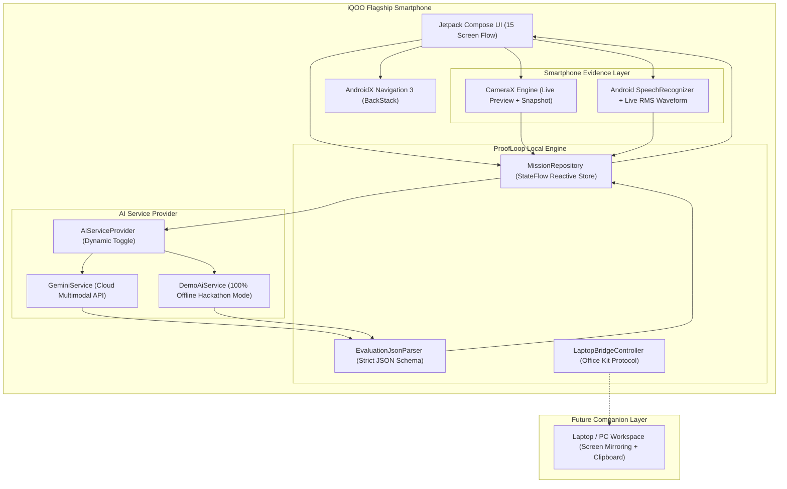

# ProofLoop (iQOO Hackathon 2026 — Smart Education)

> **"Don't just learn it. Prove it."**
> 
> *Most learning apps measure what you remember. ProofLoop measures what you can demonstrate.*

---

## ⚡ Executive Summary

**ProofLoop** is a phone-first AI learning and competency verification system built specifically for flagship Android devices (such as the **iQOO 13** and iQOO Neo series). Traditional EdTech traps learners in a passive loop:
$$\text{Learn} \longrightarrow \text{Quiz} \longrightarrow \text{Score}$$

ProofLoop transforms the smartphone from a passive video screen into an **active multimodal observation and coaching device**:
$$\text{Learn} \longrightarrow \text{Understand} \longrightarrow \textbf{Prove It} \longrightarrow \text{Perform (Camera + Mic)} \longrightarrow \text{AI Evaluation} \longrightarrow \textbf{Targeted Gap} \longrightarrow \text{Retry} \longrightarrow \textbf{Verified Proof (+17\%)}$$

---

## 📱 Deliverable Quick Links & Hackathon Verification

| Parameter | Value |
| :--- | :--- |
| **Project Name** | **ProofLoop** |
| **Track** | **Smart Education (iQOO Hackathon 2026)** |
| **Target Hardware** | Android 14+ / iQOO Flagship Smartphones (Funtouch OS / OriginOS) |
| **Build Status** | **BUILD SUCCESSFUL** (Compiled with Android SDK 36, Kotlin 2.2, Jetpack Compose) |
| **Debug APK Location** | `C:\Users\lenovo\Downloads\razro sheild\proofloop\app\build\outputs\apk\debug\app-debug.apk` |
| **Debug APK Size** | **~22.7 MB** |
| **Exact Build Command** | `.\gradlew.bat assembleDebug` |
| **Unit Test Command** | `.\gradlew.bat testDebugUnitTest` |

---

## 🏗️ Architecture Diagram



---

## 🎯 The Flagship Demonstration Scenario

### Domain: Product Thinking / Problem Solving
**Mission:** *"Your college cafeteria has a 20-minute lunch queue. You have 5 minutes to investigate why."*

### The 13-Step Execution Flow:
1. **Screen 1 — Splash Screen:** 1-second animated glow with ProofLoop brand signature and tagline.
2. **Screen 2 — Home Screen:** Displays greeting, "Good morning", main mission card ("Find the root problem behind a campus problem"), time (5 min), difficulty (Intermediate), and real-time skill telemetry.
3. **Screen 3 — Mission Brief:** Details the rules (*Observe, Ask, Hypothesize, Defend*), visual indicators that CameraX and Microphone sensors are primed.
4. **Screen 4 — Real-World Camera Mode (CameraX):** Opens back camera with live `AI CONTEXT: ACTIVE` overlay. Learner captures visual evidence of the queue/register. Gracefully falls back to high-fidelity simulated observation if camera permission is denied.
5. **Screen 5 — Voice Investigation Question:** *"What would you investigate first?"* Learner taps to speak with a dynamic pulsating waveform visualizer (measuring live rmsdB) or switches to text.
6. **Screen 6 — Interviewing Stakeholders:** *"Interview one person. What did you learn?"* Learner records student quote regarding register freezes and UPI scan failures.
7. **Screen 7 — Defending Solutions:** *"Give one solution and defend it."* Learner proposes a dedicated fast-tap pre-order lane.
8. **Screen 8 — AI Adaptive Follow-up Challenge:** *"Why wouldn't simply adding another cashier solve the root problem?"* Tests whether the student understands systemic bottlenecks versus superficial symptoms.
9. **Screen 9 — AI Analysis Screen:** 4-stage live analysis animation:
   - Understanding context ✓
   - Analyzing response ✓
   - Mapping competencies ✓
   - Preparing feedback ...
10. **Screen 10 — Skill Review Screen:**
    - Problem Framing: **88**
    - Question Quality: **74**
    - **Root-Cause Reasoning: 61 (Weakest Competency / Primary Gap)**
    - Communication: **84**
    - Decision Quality: **79**
    - Targeted diagnostic feedback: *"You moved toward a solution before validating multiple possible causes."*
    - Corrective challenge issued: *"Before choosing a solution, identify 2 possible causes and explain how you would test each."*
11. **Screen 11 — Corrective Retry Mission:** Learner performs the corrective challenge, defining test hypotheses for payment latency vs food assembly cycle times.
12. **Screen 12 — The WOW Moment (Score Improvement):**
    - Dynamic animated score transition: **61 → 78**
    - **+17% Gain**
    - Subtitle: *"Your reasoning became more evidence-driven."*
13. **Screen 13 — Verified Proof Card:**
    - High-finish credential certificate (*Application: 78%, Reasoning: 78%, Communication: 84%*).
    - Verifiable checklist of demonstrated capabilities.
    - Android native share sheet integration.
14. **Screen 14 — Skill Dashboard:** Shows aggregate metrics (*Missions Completed: 6, Skills Practiced: 4, Average Improvement: +17%*).
15. **Screen 15 — Laptop Bridge:** Future-proof architecture hook for multi-device learning, screen mirroring, and cross-device clipboard sync.

---

## 🛠️ Technology Stack

- **Platform:** Android 14+ (API 34–36)
- **Language:** Kotlin 2.2.0 (JVM Toolchain 17)
- **UI Framework:** Jetpack Compose + Material 3
- **Navigation:** AndroidX Navigation 3 (`androidx.navigation3`)
- **Camera:** CameraX (`androidx.camera:camera-camera2:1.4.1`, `camera-lifecycle`, `camera-view`)
- **Audio & Speech:** Android `SpeechRecognizer` with `RecognitionListener` & RMS dB audio levels
- **Networking:** OkHttp 4.12.0
- **Serialization:** Kotlinx Serialization JSON 1.7.3
- **Persistence:** Local Reactive StateFlow + DataStore Preferences
- **AI Model:** Google Gemini API (`gemini-2.5-flash` / configurable) + Deterministic `DemoAiService`

---

## 🤖 AI Engine & Structured JSON Schema

ProofLoop never relies on unstructured free-form LLM text. The AI evaluation layer enforces a strict JSON schema:

```json
{
  "skill": "Product Thinking",
  "overallScore": 77,
  "scores": {
    "problemFraming": 88,
    "questionQuality": 74,
    "rootCauseReasoning": 61,
    "communication": 84,
    "decisionQuality": 79
  },
  "strengths": [
    "Clearly articulated the visible 20-minute cafeteria bottleneck",
    "Captured direct customer feedback during observation"
  ],
  "weaknesses": [
    "Jumped to a single solution before validating multiple possible causes",
    "Assumed cashier count was the primary limiter without measuring cycle times"
  ],
  "evidence": [
    "Investigated cashier queue without verifying payment vs food preparation latency",
    "Did not test alternative hypotheses regarding student ordering behavior"
  ],
  "primaryGap": "Root-Cause Reasoning",
  "feedback": "You moved toward a solution before validating multiple possible causes. Test alternative explanations before committing resources.",
  "nextChallenge": "Before choosing a solution, identify 2 possible causes and explain how you would test each."
}
```

---

## 🚀 How to Run & Build

### 1. Build the APK locally
Ensure JDK 17 is installed and on your PATH:
```powershell
$env:JAVA_HOME = "C:\Program Files\Microsoft\jdk-17.0.20.101-hotspot"
$env:Path = "$env:JAVA_HOME\bin;" + $env:Path

# Run unit tests
.\gradlew.bat testDebugUnitTest

# Assemble APK
.\gradlew.bat assembleDebug
```

The compiled APK will be at:
```
app\build\outputs\apk\debug\app-debug.apk
```

### 2. Install on an Android / iQOO Smartphone
Connect your iQOO device via USB with **USB Debugging** enabled:
```powershell
adb install -r app\build\outputs\apk\debug\app-debug.apk
adb shell am start -n com.example.proofloop/.MainActivity
```
*Or copy `app-debug.apk` directly to your phone via USB file transfer, open Files, and tap Install.*

---

## ⚙️ AI Configuration & Demo Mode

### Demo Mode (Default, Recommended for Live Hackathon Stage)
ProofLoop comes pre-configured with **DEMO MODE: ACTIVE**.
- Runs **100% offline** without requiring internet connectivity or API keys.
- Guaranteed zero network latency and zero API quota errors.
- Provides the exact, believable demonstration data required by the hackathon judges.

### Live Cloud AI (Google Gemini API)
You can configure a live Gemini API key in two ways:
1. **In-App (No re-compile needed):**
   - Tap the **`DEMO MODE`** chip in the top right corner of the Home screen.
   - Toggle off Demo Mode and paste your Gemini API key (`AIzaSy...`).
   - Tap **Save**.
2. **Build Time Configuration:**
   - In `local.properties`:
     ```properties
     GEMINI_API_KEY=your_actual_gemini_api_key_here
     ```
   - Re-run `.\gradlew.bat assembleDebug`.

---

## 🛡️ Robustness & Graceful Fallbacks

| Scenario | Graceful Fallback Behavior |
| :--- | :--- |
| **Camera permission denied** | Displays simulated high-fidelity environment observation view; app continues seamlessly. |
| **Microphone permission denied** | Transitions seamlessly to typed text mode with 1-tap quick suggestions. |
| **No Internet / API timeout** | Automatically falls back to deterministic local evaluation; no crashes or infinite spinners. |
| **No SpeechRecognizer on device** | Displays text input box with pre-populated realistic student responses. |

---

## 💻 Future Work: Office Kit & Laptop Bridge

ProofLoop includes an **Office Kit architectural specification** (accessible via the laptop icon on the Home screen):
- **Phone as Observer & Coach:** The iQOO phone captures physical whiteboard drawings, real-world interviews, and spoken arguments.
- **Laptop as Canvas:** The laptop displays complex case data, spreadsheets, and coding environments.
- **Bridge Protocol:** Outlined for cross-device clipboard sync, local screen observation, and instant peer-to-peer evidence transfer.
